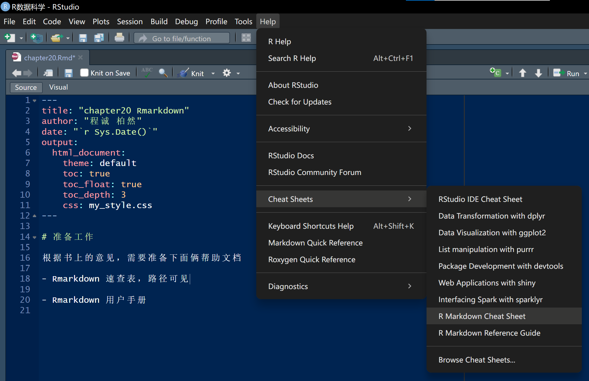
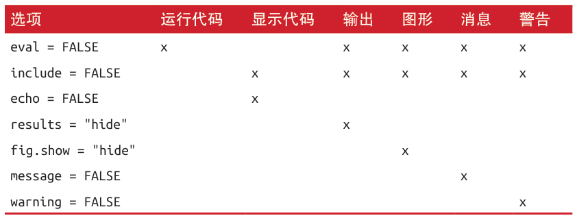

# 准备工作

根据书上的意见，需要准备下面俩帮助文档

- Rmarkdown 速查表

- Rmarkdown 用户手册

{width="500"}

<p>

# Rmarkdown 基础

Rmarkdown反正之前也用过，这里用自己话把书上东西梳理一遍干脆。首先Rmarkdown会创建一个`*.Rmd`的文件这个不用说，然后这个文件能输出PDF、Word、HTML文件（默认HTML）。

而至于Rmarkdown文件本身，有需要现在关注的主要仨成分：

1. 头部的YAML文件头，据说能直接不要，不过这个还是作用挺大的。

2. \`\`\`组成的代码块

3. 相对“普通的”文本内容

在Rmarkdown中，代码块是可以运行并且可以结果交互显示，可以鼠标点那个右上角的RUN，还有快捷键`Ctrl+Shift+Enter`（话说不用Shift也行欸），举个例子：

```{r test code, cached = TRUE}

library(tidyverse)
library(ggplot2)

df <- diamonds

ggplot() + 
  geom_point(df, mapping = aes(carat, price))
```

<p>

整挺好，而代码运行结果和输出图片的显示设置，包括代码块本身的显示可以在代码块右上角的设置里调，这里用的默认。哦当然，Render生成输出的快捷键`Ctrl+Shift+K`。

下面的章节将会详细介绍刚刚说过的那仨组成部分（文本、代码块、YAML文件头）。

# 使用Markdown格式文本

这一节就把Rmarkdown基础语法给讲了以下（其实就是Markdown语法），其实也跟书上说的一样，也不用专门记忆，用得多了就行了，真忘了再去查就好了。真不行用ai。真的，多写就自然顺手了。所以这一节的笔记实在做不了啥。

# 代码段

这里就是有个插入代码块的快捷键感觉不错`Ctrl+Alt+I`，挺好。然后就又说了运行的快捷键`Ctrl+Enter`和`Ctrl+Shift+Enter`，后者是全部运行。然后代码块头部有个"{}"的玩意，那个花括号里面写代码名字，这样程序知道你要运行啥，默认用R语言。

## 代码段名称

刚刚说代码块头部那个花括号{}用来声明所用的程序语言，在语言名称后空一格就是直接给所在的代码块命名，这样命名会很方便。

```{r 命名例子}
print('给代码块命名我直觉会很方便')
```

<p>

有个比较特殊的代码块名字：**setup**，这个名字的代码块会在其他代码块运行前先自动运行一次。

## 代码段选项

这个就是代码和结果的呈现效果设置，也是在代码框头部进行设置，虽然可以记那几个参数，不过我觉得用图形界面进行设置应该会用得多一些。



<p>

## 表格

Rmarkdown的表格可以手搓出来，跟tribble一样，而且可以进行一些基础的设置，比如单元格内的内容居中靠左靠右什么的。不过合并单元格什么的就感觉设置起来很长麻烦了。

|这|是|表|格|
|:---:|:---:|:---:|:---:|
|1|1|1|1|
|2|3|4|5|

当然止这种在文本中的表格，r代码框运行输出也会整出表格，这种类型的表格如果我们嫌默认的格式太无聊可以使用`knitr::kable`函数进行更改。
```{r form_output}
# 这是默认的数据框输出：
print(mtcars[1:5, ])

# 然后这是使用kable的数据框输出
knitr::kable(mtcars[1:5, ], 
             caption = 'A knitr kable' #可以给表格整标题
             )
```

<p>

然后同样有些别的包被提及`xtable`、`stargazer`、`pander`、`tables`和`ascii`。说是都帮助r代码生成格式化表格。

## 缓存

有时候吧，为了确保Rmarkdown生成的文件格式是正确的，可能需要反复`Ctrl+Shift+K`大法进行生成，但是每次生成如果Rmd里有代码就需要每次花蛮多时间去运行。就比如刚刚只是画个散点图就需要相比平时怪长时间了。这一小节就是讲可以在代码框头部设置`cached = TRUE`，这个参数可以将代码输出保存在缓存里，此后的运行如果检测代码没有被修改，上次的结果再拿出来用，knit的时候省些时间。

不过`cached`参数之检查代码是否被修改，但是chunk之间的依存关系并不考虑。比如下面，`cached_chunk`是依赖着那个名为`data_source`的chunk的。假如`data_source`被修改而`cached_chunk`没被修改，那么输出的结果并不会有所改变的，这显然是错误的。解决办法就是搁`cached_chunk`的头部多加一个`dependson`参数：

```{r data_source}
df <- ggplot2::diamonds
```

然后是需要改头部声明参数

```{r cached_data, cache = TRUE, dependson = 'data_source'}
knitr::kable(df[1:5, ])
```

<p>

不过有个问题，cached参数只检测Rmd文件内部的代码变化，而外部的文件变化一般不会考虑在内（比如所读取的数据文件本身发生了变化）。书上虽然介绍了一些对应方法。其中一个就是在被依赖的chunk头部加一个声明参数`cache.extra`，只要其内容发生变换则缓存失效，然后搭配`file.info('data_file.csv')`使用，后者将文件修改信息返回给`cache.extra`。

```{r example_of_cache_data_file, cache.extra = file.info('data.csv')}
df <- read.delim('data.csv')
```

<p>

同时书上也建议应该定期使用`knitr::clean_cache()`函数清理所有缓存。

## 全局选项

虽然之前说过可以通过chunk的头部参数对输出效果进行调整，但是如果chunk很多，一个一个调整必要的东西很麻烦欸（比如在knit文档里隐藏系统消息）。所以这里书本介绍了`knitr::opts.chunk$set()`，它可以为所有代码做好预设。比如我特别想隐藏系统消息。

```{r 全局设置代码, eval=FALSE}
knitr::opts_chunk$set(message = FALSE) #隐藏系统信息
knitr::opts_chunk$set(warning = FALSE) #隐藏警告
knitr::opts_chunk$set(echo = F) #隐藏代码
```

<p>

## 内联代码

我们知道除了代码框以外，使用\`\`还可以使用代码条，这个代码条也是可以运行的，在撰写报告的时候，这个功能会比较好用。书里给的示范不够细致，这里补充一下。

假如我们要报告`diamonds`数据集中的个案数量，不得用`nrow()`函数么？就很简单，在第一个\`的后边声明程序语言的名字然后空格就可以了：

> 这份数据中包含了r nrow(diamonds)颗钻石的信息，平均价格为r mean(diamonds$price, na.rm = T)。

效果就是：这份数据中包含了`r nrow(diamonds)`颗钻石的信息，平均价格为`r mean(diamonds$price, na.rm = T)`。

当然，有些时候撰写报告我们需要做保留小数点后2位之类的工作，这就需要使用`format()`函数，然后使用辅助函数来方便我们使用：`comma <- function(x) {format(x, nsmall = 2, big.mark = ',')}`。那么经过改造，我们写报告时候就应该是：

`r comma <- function(x) {format(x, nsmall = 2, big.mark = ',')}`

> 这份数据中包含了r comma(nrow(diamonds))颗钻石的信息，平均价格为r comma(mean(diamonds$price, na.rm = T))。

效果则是：这份数据中包含了`r comma(nrow(diamonds))`颗钻石的信息，平均价格为`r comma(mean(diamonds$price, na.rm = T))`。

# 排错--Debug

这里教了如何在Rmarkdown环境下debug，但是我以为不如在脚本写好了在将代码复制粘贴，这不更省事么？书里教了使用RUN ALL CHUNK来找出错误然后更改，快捷键`Ctrl+Alt+R`。

# YAML文件头

这里倒是我一直想了解的内容。YAML控制了输出文档的诸多细节，比如主题、输出文件格式、日期作者题目什么的。但本节的介绍也就文档头参数那里有用但介绍的看不大懂也不详尽，文献引用不如看我自己写研究报告时候的Rmarkdown直接上手用。


